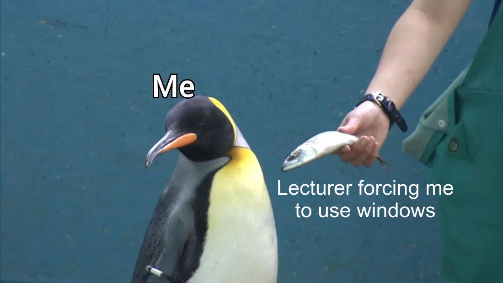

# SCIRPT PROGRAMMING
A repository containing scripts written as a part of coursework.
Each folder includes script, it's detailed definition and run commands.

| 📖 Task                    | link                                     |
|---------------------------|------------------------------------------|
| 1 practice (batch)        | [here](./1%20practice%20-%20BATCH)       |
| 2 practice (power-shell)  | [here](./2%20practice%20-%20POWER-SHELL) |
| 3 practice (bash)         | [here](./3%20practice%20-%20BASH)        |
| 4 practice (python)       | [here](./4%20practice%20-%20PYTHON)      |
| 5 practice (php)          | [here](./5%20practice%20-%20PHP)         |
| PROJECT - server launcher | [TODO](#3)                               |

