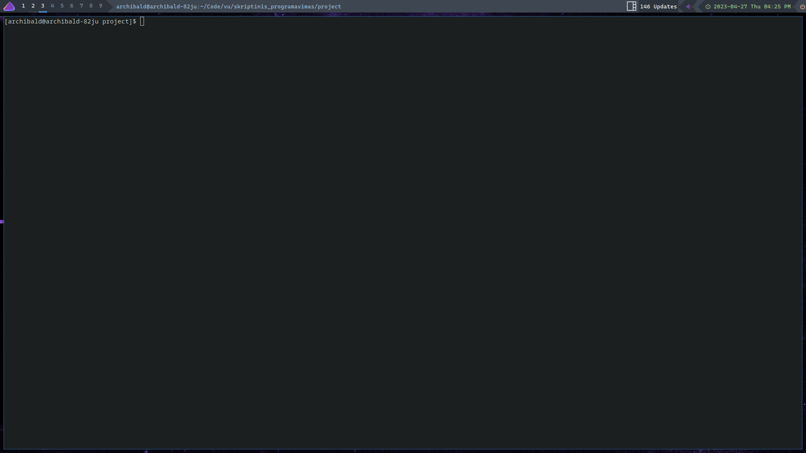

# Project launcher
| 📖 Table Of Contents  | link       |
|----------------------|------------|
| About                | [here](#1) |
| How to setup         | [here](#2) |
| How to run           | [here](#3) |

## About  🔍 
This script allow to easily run multiple local servers.  
It is made to automate local project launching during development.

### Available Options
| Option            | Description                                           |
| ----------------- | ----------------------------------------------------- |
| `project_name`    | Runs the project with the specified project name      |
| `-n project_name` | Creates a new project with the specified project name |
| `-l`              | Lists all available projects                          |
| `-h`              | Displays the list of available commands               |

## How to setup  
 - Make sure launcher.sh is exucutable by running `chmod +x $launcher.sh`
 - Make sure you are have installed `alacritty` terminal
   - If you want to use different terminal feel free to modify `run_project` function
   - After modifying run `./compile.sh`
 - If you want to change where projects are stored change variable `projects_dir` inside `main.sh`
    - After modifying run `./compile.sh`

 
## How to run 🛠️ 
1. Run `./launcher` with specified flag or project name
